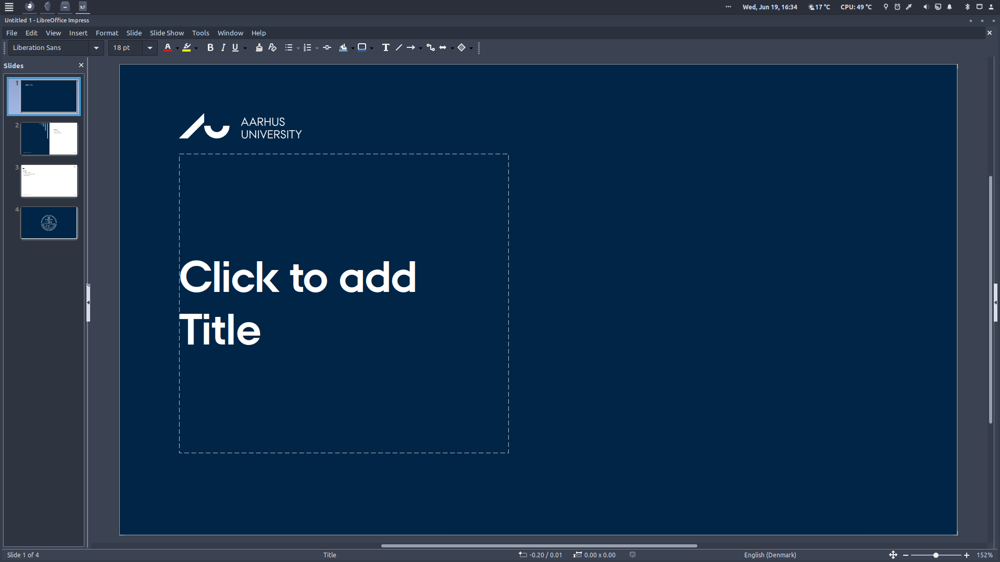
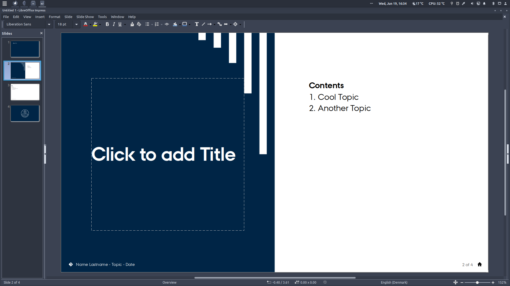

# AU-LibreOffice-Templates
A repository of LibreOffice templates for presentations and documents using the [style guidelines](https://medarbejdere.au.dk/en/administration/communication/guidelines/design) set by [Aarhus University](https://international.au.dk/).

This is to enable students to use free-and-open-source alternatives to products like MS-Office.

## Presentation Template
For LibreOffice Impress. Automatic footer and slide-numbering. Lower-right corner contains hyperlink to return to first slide. Remember to install the [AU font](https://medarbejdere.au.dk/en/administration/communication/guidelines/guidelinesforfonts).
<table>
  <tr>
    <td></td>
    <td></td>
  </tr>
  <tr>
    <td></td>
    <td></td>
  </tr>
</table>
