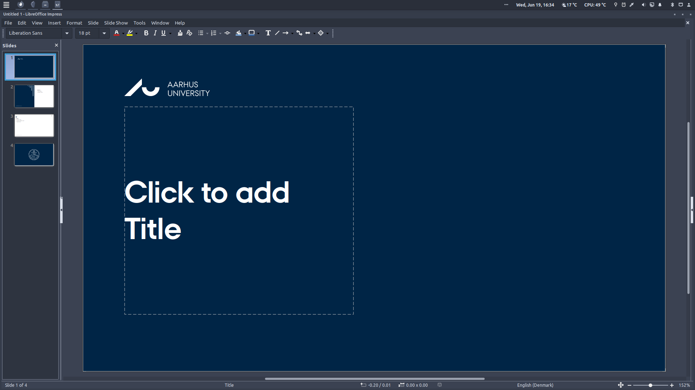
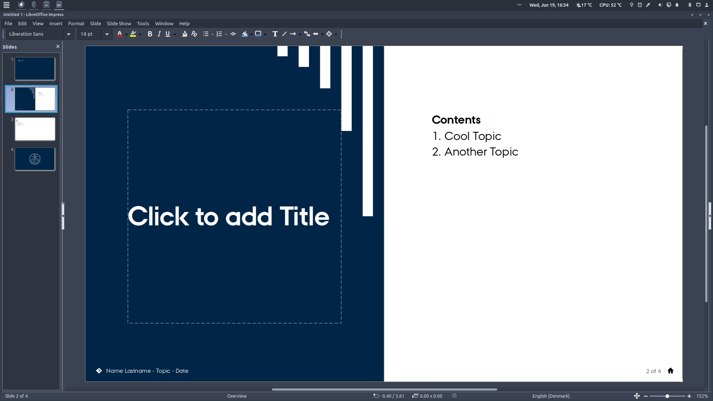
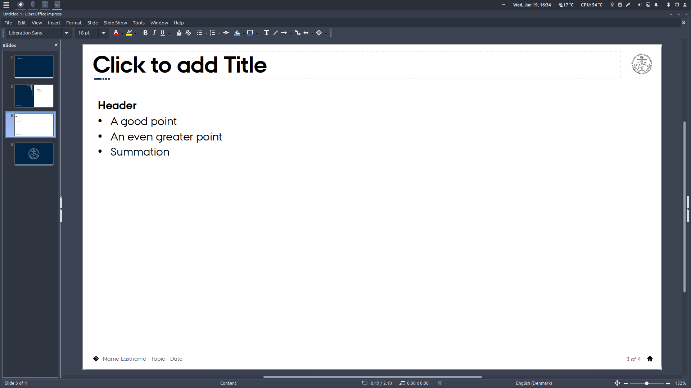
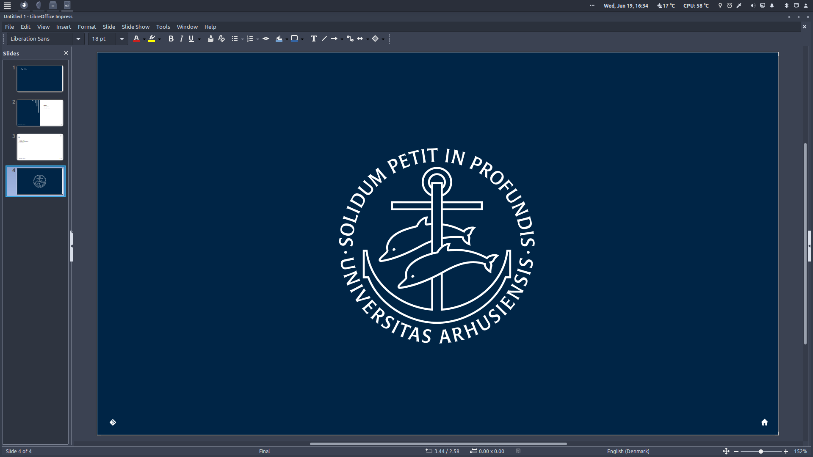

# AU-LibreOffice-Templates
A repository of LibreOffice templates for presentations and documents using the [style guidelines](https://medarbejdere.au.dk/en/administration/communication/guidelines/design) set by [Aarhus University](https://international.au.dk/). This is to facilitate the use of free-and-open-source alternatives to products like MS-Office. The template *may* work with Powerpoint as well.

**Versions**:
- [LibreOffice version (.otp)](aarhus_university_slides_libreoffice_version.otp)
- [Powerpoint version (.pptx)](aarhus_university_slides_powerpoint_version.pptx)
- [Powerpoint template version (.potx)](aarhus_university_slides_powerpoint_template_version.potx)

## Presentation Template
<table>
  <tr>
    <td></td>
    <td></td>
  </tr>
  <tr>
    <td></td>
    <td></td>
  </tr>
</table>

**Notes**:
- Remember to install the [AU font](https://medarbejdere.au.dk/en/administration/communication/guidelines/guidelinesforfonts).
- In LibreOffice, use `Insert` --> `Header and footer` to edit the footer-text.
- The home icon is a hyperlink to the first slide (a home button).
